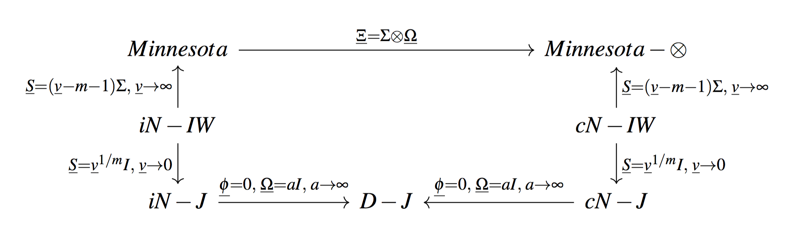

## {data-background="Sherlock-BBC-The-Hounds-Of-Baskerville.png"}

## Bayesian Vector Autoregression Paradox: 

- High predictive power

- Underused and confused

## What is a BVAR?

BVAR = VAR + Bayesian approach

VAR: 
\[
\begin{cases}
y_t =\Phi_{const}+ \Phi_1 y_{t-1} + \Phi_2 y_{t-2} +\ldots + \Phi_p y_{t-p} + \varepsilon_t \\ 
\varepsilon_t\sim \mathcal{N}(0,\Sigma)
\end{cases}
\]

Bayesian approach:

1. Impose some prior distribution on $\Sigma$, $\Phi_{const}$, $\Phi_1$, $\Phi_2$, ...

1. Use formula for conditional probability $p(\theta|data) \sim p(data|\theta) \cdot p(\theta)$ to obtain posterior distribution.

1. Use posterior distribution for forecasting.

## On the shoulders of giants:

- Robert Litterman, 1979, Techniques of forecasting using vector autoregressions

- Rao Kadiyala and Sune Karlsson, 1997, Numerical Methods for Estimation and Inference in Baesian VAR-Models

- Christopher A. Sims  and Tao Zha, 1998, Bayesian methods for dynamic multivariate models

- Sune Karlsson, 2012, Forecasting with Bayesian Vector Autoregressions

- more than 7 000 hits in [scholar.google.com](https://scholar.google.com/) 

Note: ARMA gives more than 700 000 hits!

## Why the BVAR paradox?

1. Great Grimpen Mire of prior distributions

1. Great Grimpen Mire of software

1. No MCMC in bachelor probability course


# Great Grimpen Mire of prior distributions

## General overview of BVARs:

- structural vs reduced form BVARs

Structural: $Ay_t = B_0+ B_1 y_{t-1} +\ldots + B_p y_{t-p} + u_t$

Reduced form: $y_t =\Phi_{const}+ \Phi_1 y_{t-1} + \Phi_2 y_{t-2} +\ldots + \Phi_p y_{t-p} + \varepsilon_t$

Link: $B_i = A \Phi_i$. 

- time varying parameters vs classic BVARs

The parameters $\Phi_i$ may change over time.


## Classical BVARs in reduced form 

$y_t =\Phi_{const}+ \Phi_1 y_{t-1} + \Phi_2 y_{t-2} +\ldots + \Phi_p y_{t-p} + \varepsilon_t$

We should impose prior on $\Sigma$, $\Phi_{const}$, $\Phi_1$, $\Phi_2$, ...

Here $y_t$ is multivariate: $m\times 1$.

For $m=10$ variables and $p=4$ lags we have more than 400 parameters. 

## Grimpen Mire of priors

1. **Confusing names for priors**

1. **No clear classification of priors**

1. **Contradictory notation**

Results in:

1. Coding mistakes

1. You should struggle a lot to understand

1. Underuse of BVARs

## Everything is simple:

\[
\begin{cases}
y_t =\Phi_{const}+ \Phi_1 y_{t-1} + \Phi_2 y_{t-2} +\ldots + \Phi_p y_{t-p} + \varepsilon_t \\ 
\varepsilon_t\sim \mathcal{N}(0,\Sigma)
\end{cases}
\]

We should place prior on:

1. Covariance matrix $\Sigma$

1. Coefficients $\Phi_i$

## Prior for $\Sigma$ and $\Phi_i$:

1. Independent $\Sigma$ and $\Phi_i$

Prior $p(\Sigma)$ and prior $p(\Phi_{const}, \Phi_1, \ldots, \Phi_p)$

1. Conjugate $\Sigma$ and $\Phi_i$

Prior $p(\Sigma)$ and prior $p(\Phi_{const}, \Phi_1, \ldots, \Phi_p | \Sigma)$


## Sharp classification:

1. Independent $\Sigma$ and $\Phi_i$:
    - Independent Normal-Inverse Wishart prior
    - Independent Normal-Jeffreys prior
    - Minnesota prior

1. Conjugate $\Sigma$ and $\Phi_i$: 
    - Conjugate Normal-Inverse Wishart prior
    - Conjugate Normal-Jeffreys prior
    - Kronecker-subcase of Minnesota prior

## Technical details:

- Independent Normal-Inverse Wishart prior

\[
\begin{cases}
\Sigma \sim \mathcal{IW}(\underline S,\underline \nu) \\
\phi \sim \mathcal{N}(\underline \phi, \underline \Xi) \\
p(\phi, \Sigma) = p(\phi)\cdot p(\Sigma)
\end{cases}
\]

- Minnesota prior

\[
\begin{cases}
\Sigma = const\\
\phi \sim \mathcal{N}(\underline \phi, \underline \Xi)
\end{cases}
\]

- Conjugate Normal-Inverse Wishart prior

\[
\begin{cases}
\Sigma \sim \mathcal{IW}(\underline S,\underline \nu) \\
\phi | \Sigma \sim \mathcal{N}(\underline \phi, \Sigma \otimes \underline \Omega)
\end{cases}
\]

## Here be dragons



## Conjugate Normal-Inverse Wishart prior

\[
\begin{cases}
\Sigma \sim \mathcal{IW}(\underline S,\underline \nu) \\
\phi | \Sigma \sim \mathcal{N}(\underline \phi, \Sigma \otimes \underline \Omega)
\end{cases}
\]

- Explicit formula for posterior distribution

- You can sample directly from posterior

- Posterior distribution can be calculated in a second way:

    1. Add artificial observations
    
    2. Use OLS with augmented dataset
    
## Two ways to specify a prior

1. Explicit use of the formula

\[
\begin{cases}
\Sigma \sim \mathcal{IW}(\underline S,\underline \nu) \\
\phi | \Sigma \sim \mathcal{N}(\underline \phi, \Sigma \otimes \underline \Omega)
\end{cases}
\]

2. Implicit approach with artificial observations:
    - Augment dataset: obtain $X^*$ and $Y^*$
    - $\overline \Phi$ --- estimates of the regression of $Y^*$ on $X^*$
    - $\overline S$ --- cross-products of residuals
    - $\overline \Omega^{-1}$ --- cross-products of of regressors

# Great Grimpen Mire of software

## Current situation:

- a bunch of separated `MATLAB` functions. Poor documentation, poor stability

- `Eviews` point and click interface. Poor documentation. Poor stability. 

- three `R`-packages: 
    - `BMR`. Good documentation. Poor stability. 
    - `MSBVAR`. Poor documentation. Poor stability.
    - `bvarsv`. Good documentation. Complex model.
    
Almost no integration at all.
    

## Ideal package for BVARs:

1. **Open source**. Only R/python/Julia/gretl. MATLAB/Stata/Eviews are almost dead. 

1. **Well documented**. Consistent notation with major articles.

1. **Robust**. Sever multicollinearity problem. Should not throw errors! 

1. **Easy to use**. Reasonable defaults to plug and play!

1. **Well integrated**. Do not reinvent the weel. 

1. **Fast**. Probably Julia/C++ implementation.

## Developing `R` package `bvarr` 

- **Open source**. **OK**

- **Well documented**. **Almost OK**. Article «BVAR mapping» should soon appear in Prikladnaya ekonometrika. 

- **Easy to use**. **Almost OK**. Some defaults are imposed. More testing is on the way.

-  **Robust**. **Almost OK**. We use SVD and other tricks of the trade. 

We never use the formula $\hat\beta = (X'X)^{-1}X'y$ :)

## Package `bvarr` todo list:

1. **More priors**. Only conjugate-inverse normal Wishart for the moment

1. **Visualise priors**. Almost no one really understands priors.

1. **Well integrated**. Integration with `forecast`, `vars` and `BMR` `R`-packages is planned.

1. **Fast**. Irrelevant for conjugate-inverse normal Wishart.

<!--
## Some random plot

```{r, message=FALSE, fig.height=3, fig.width=4, fig.align='center'}
library(ggplot2)
qplot(rnorm(100)) + xlab("Привет, Ира!")
```
-->


## Plug-and-play!

1. Install

```{r, eval=FALSE}
install.packages(c("sophisthse", "devtools", "dplyr"))
devtools::install_github("bdemeshev/bvarr")
```

2. Attach

```{r, eval=FALSE}
library("dplyr")
library("sophisthse")
library("bvarr")
```

3. Load and clean data

```{r, eval=FALSE}
y <- sophisthse(c("UNEMPL_Y", "GDPVA_T_Y_DIRI"))
y <- y[, c("UNEMPL_Y", "GDPVA_T_Y_DIRI")] %>% na.omit
```

4. Estimate and predict

```{r, eval=FALSE}
setup <- bvar_conj_setup(y, p = 4)
model <- bvar_conj_estimate(setup)
y_hat <- bvar_conj_forecast(model, h = 2)
```

# No MCMC in bachelor probability/econometrics course

## What can we do?

1. If you are a probability/econometrics lecturer. Just introduce MCMC in the course!

2. If you are a student. Ask your lecturer about Bayesian approach and MCMC. It's modern, stylish and ye-ye!

## How to introduce MCMC?

1. Don't panic!

1. Basic course. Use MCMC as a black box for the conditional probability formula.

1. Advanced course. Use MCMC to illustrate the convergence in distribution.

## Software to use

1. Plug-and-play bayesian solutions for a wide range of classic models. 
    - `R` + `MCMCpack`. 
1. Make students build they own hierarchical models:
    - `R`/`python`/`Julia` + `STAN`/`JAGS`
    - `Julia` + `Lora`/`Mamba`
    - `python` + `PyMC`


# Welcome party is soon enough


## Our questions:


1. An analog of M3-competition for multivariate time series?

1. A good multivariate time series plot? For 20+ series at once?

1. How to obtain $(X'X)^{-1}$ if SVD of $X$ fails?

1. How to visualise Inverse-Wishart prior? Or prior for 400+ coefficients?

1. Any experience with MCMC in bachelor courses?


## Contacts:

Boris Demeshev: boris.demeshev@gmail.com

Oxana Malakhovskaya: oxana.malakhovskaya@gmail.com

Project web-page: [bdemeshev.github.io/bvarr](http://bdemeshev.github.io/bvarr/)


## Quote for the BVAR paradox:

> Я вам, ребята, на мозги не капаю, но вот он, перегиб и парадокс: кого-то выбирают римским папою, кого-то запирают в тесный бокс.
>
> Владимир Высоцкий
